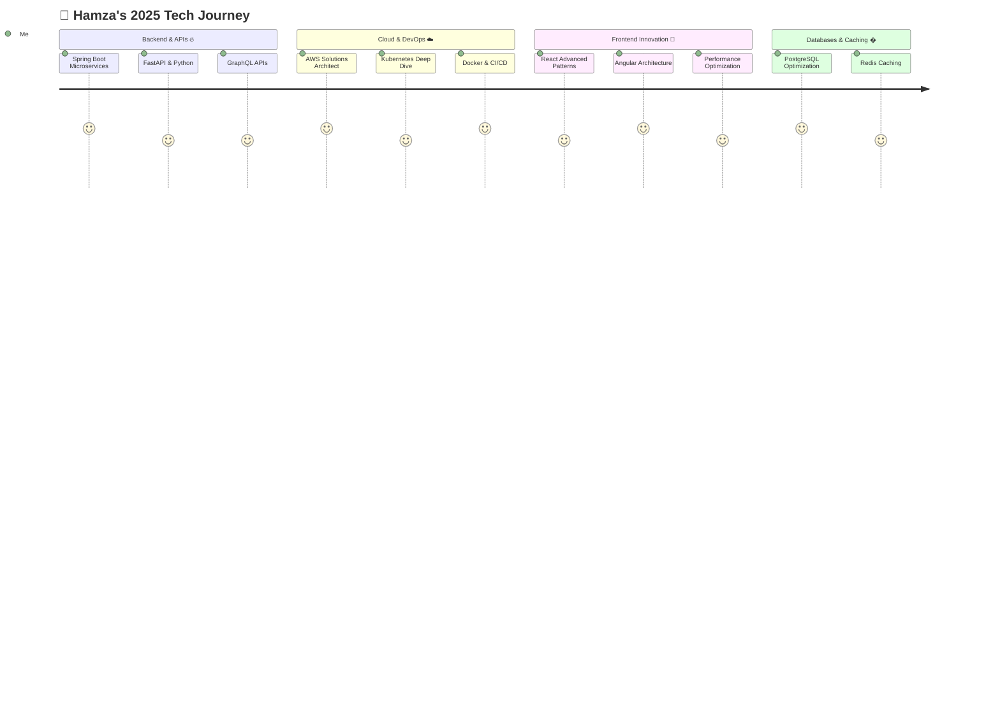

<!-- ============================================================ -->
<!--              TERMINAL WAVE BANNER                            -->
<!-- ============================================================ -->


<!-- ============================================================ -->
<!--              ANIMATED TYPING TITLE                           -->
<!-- ============================================================ -->
<p align="center">
  <a href="https://git.io/typing-svg">
    
  </a>
</p>

<!-- ============================================================ -->
<!--              SOCIAL BADGES                                   -->
<!-- ============================================================ -->
<p align="center">
  <a href="mailto:hamza.boumanjel@gmail.com">
    
  </a>
  <a href="https://www.linkedin.com/in/hamza-boumanjel-5a8754306/">
    
  </a>
  <a href="https://github.com/Hamza-01f">
    
  </a>
  <a href="https://www.instagram.com/h_boumanjel/">
    
  </a>
  <a href="https://app.docker.com/accounts/hamzaboumanjel">
    
  </a>
</p>

<!-- ============================================================ -->
<!--              STATS COUNTERS                                  -->
<!-- ============================================================ -->
<p align="center">
  
  
  
</p>

<br/>

---

<!-- ============================================================ -->
<!--              TERMINAL ABOUT ME                               -->
<!-- ============================================================ -->

##  `$ cat about_me.txt`


```bash
 ╭─────────────────────────────────────────────╮
 │  hamza@dev:~$ ./profile.sh                  │
 │                                             │
 │  Name    : Hamza Boumanjel                  │
 │  Role    : Full-Stack Developer             │
 │  OS      : Linux (btw 🐧)                  │
 │  Editor  : IntelliJ IDEA / VS Code          │
 │  Shell   : zsh + Oh My Zsh                 │
 │  Theme   : Tokyo Night / Catppuccin         │
 │                                             │
 │  > Currently Building  : Scalable APIs      │
 │    with Spring Boot & FastAPI               │
 │  > Learning             : Kubernetes &      │
 │    Microservices Architecture               │
 │  > Philosophy : "Clean code always looks   │
 │    like someone who cared wrote it"         │
 │  > Debug fuel  : ☕ strong coffee           │
 │                                             │
 │  [OK] status: ready_to_ship                 │
 ╰─────────────────────────────────────────────╯
```

<br clear="right"/>

---

<!-- ============================================================ -->
<!--              PORTFOLIO SECTION                               -->
<!-- ============================================================ -->

## 🌐 `$ open portfolio.url`

<div align="center">

> **🖥️ Check out my portfolio — built with passion, deployed with confidence.**

<a href="https://boumanjel.vercel.app/">
  
</a>

*Full-Stack Developer specializing in Angular · Spring Boot · FastAPI · DevOps*

</div>

---

<!-- ============================================================ -->
<!--              TECH STACK                                      -->
<!-- ============================================================ -->

## ⚙️ `$ ls -la ./tech_stack/`

<div align="center">

### 🎨 Frontend

<p>
  
</p>

### ⚡ Backend

<p>
  
</p>

### ☁️ Cloud & DevOps

<p>
  
</p>

### �️ Databases

<p>
  
</p>

### 🔧 Tools & IDEs

<p>
  
</p>

</div>

---

<!-- ============================================================ -->
<!--              GITHUB ANALYTICS                                -->
<!-- ============================================================ -->

## 📊 `$ git log --oneline --graph --all`

<div align="center">
  
  
</div>

<div align="center">
  
</div>

<div align="center">
  
</div>

---

<!-- ============================================================ -->
<!--              JOURNEY MERMAID                                 -->
<!-- ============================================================ -->

## �️ `$ cat journey_2025.log`



---

<!-- ============================================================ -->
<!--              GOALS TABLE                                     -->
<!-- ============================================================ -->

## 🎯 `$ cat goals_2025.md`

<div align="center">

| Goal | Status | Progress |
|------|--------|----------|
| 🚀 Launch a SaaS product with Spring Boot & FastAPI | 🟡 In Progress | `██░░░░░░░░` 10% |
| ☁️ Obtain AWS Solutions Architect cert | 🟡 In Progress | `██░░░░░░░░` 10% |
| 🌍 Contribute to 12 open-source projects | 🟡 In Progress | `█░░░░░░░░░` 5% |
| 📚 Write 24 technical blog posts | 🟡 In Progress | `█░░░░░░░░░` 8% |
| 🏆 Reach 1K GitHub followers | 🟡 In Progress | `█░░░░░░░░░` 4% |

</div>

---

<!-- ============================================================ -->
<!--              SNAKE ANIMATION                                 -->
<!-- ============================================================ -->

<div align="center">
  
</div>

---

<!-- ============================================================ -->
<!--              FOOTER                                          -->
<!-- ============================================================ -->

<div align="center">

### 🤝 Open for Collaboration

| 💼 Full-time Opportunities | 🚀 Exciting Projects |
|:-:|:-:|
| 🎯 Open Source Contributions | 📚 Knowledge Sharing |

<br/>

**📬 Let's connect & build something great together!**

<a href="mailto:hamza.boumanjel@gmail.com">
  
</a>
<a href="https://www.linkedin.com/in/hamza-boumanjel-5a8754306/">
  
</a>
<a href="https://boumanjel.vercel.app/">
  
</a>

<br/><br/>

> *"Any sufficiently advanced technology is indistinguishable from magic."*
> — Arthur C. Clarke

<br/>

⭐ **If you like my work, drop a star — it means the world!** ⭐

</div>

<!-- FOOTER WAVE -->

